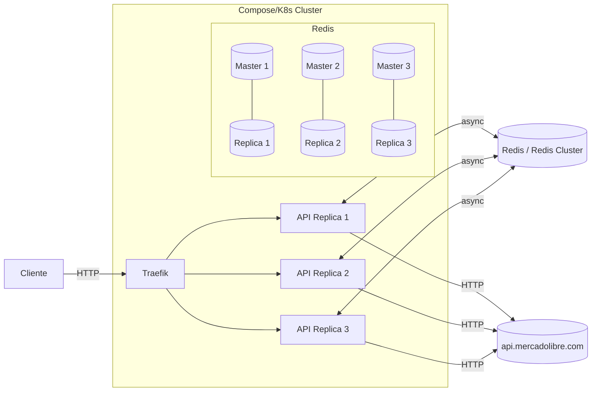

# Architecture Meli-Proxy

## Resumen

Proxy HTTP de alto rendimiento (FastAPI) hacia `https://api.mercadolibre.com`, con limitación de tasa distribuida en Redis (single o Cluster), métricas Prometheus y balanceo con Traefik.

## Diagrama (alto nivel)

## Flujo de Request

1. Traefik recibe el request y balancea a una réplica de la API.
2. Middleware de Rate Limit consulta/incrementa contadores en Redis por ventana de 60s (IP, Path, IP+Path).
3. Si excede límite → 429 con headers `Retry-After`, `X-RateLimit-*`.
4. Si pasa, el proxy reenvía hacia `api.mercadolibre.com` usando un `httpx.AsyncClient` compartido.
5. La respuesta se devuelve al cliente con headers filtrados y se propagan `X-Forwarded-For/Host/Proto` hacia la API de Mercado Libre.
6. Métricas: `/metrics` expone Prometheus (latencias/requests), contadores de rate-limit (allowed/blocked) y actualizaciones de configuración.

## Componentes

- FastAPI App: `app/fast_api.py`
  - CORS, middleware de rate limit, rutas `/health`, `/metrics`, y proxy catch‑all.
- Proxy: `app/presentation/proxy.py`
  - Cliente `httpx` global con pool/keepalive para alto throughput.
- Rate Limit: `app/presentation/api/middlewares/rate_limit.py`
  - Claves por ventana: `rl:ip:{ip}:{window}`, `rl:path:{prefix}:{window}`, `rl:ippath:{ip}:{prefix}:{window}`.
  - Headers: `X-RateLimit-Limit/Remaining/Reset`.
  - Métricas: `meli_proxy_rate_limit_allowed_total`, `meli_proxy_rate_limit_blocked_total`, `meli_proxy_rate_limit_config_updates_total`.
  - Eventos: cada cambio publica JSON en `rl:config:events` y persiste `rl:config:updated_at`.
- Admin API: `app/presentation/api/routes/rate_limits.py`
  - Protegida por tokens (`X-Admin-Token`) definidos en configuración.
  - Permite GET/PUT/PATCH/POST(reset) de reglas en caliente.
- Redis Client: `app/infrastructure/redis_client.py`
  - Single o Cluster (auto por `REDIS_CLUSTER_NODES`), readiness con backoff.
- Observabilidad: Prometheus + Grafana (compose `deploy/*`).
- Balanceo: Traefik (compose) con labels en `api`.

## Variables relevantes

- `MELI_API_URL` (default: `https://api.mercadolibre.com`)
- Redis single: `REDIS_HOST`, `REDIS_PORT`, `REDIS_PASSWORD`, `REDIS_DB`
- Redis cluster: `REDIS_CLUSTER_NODES` (lista host:port)
- Backoff Redis: `REDIS_INIT_RETRIES`, `REDIS_INIT_BACKOFF`
- Rate limit JSON: `RATE_LIMIT_RULES_IP_JSON`, `RATE_LIMIT_RULES_PATH_JSON`, `RATE_LIMIT_RULES_IP_PATH_JSON`
- Administración: `ADMIN_API_TOKENS` (lista separada por comas para proteger `/admin/rate-limits`)

## Perfiles/Despliegue

- Compose perfiles: `single` y `cluster` (ver README)
- Escalado: `--scale api=3` (Traefik balancea), o K8s con Deployment + Service + HPA.
